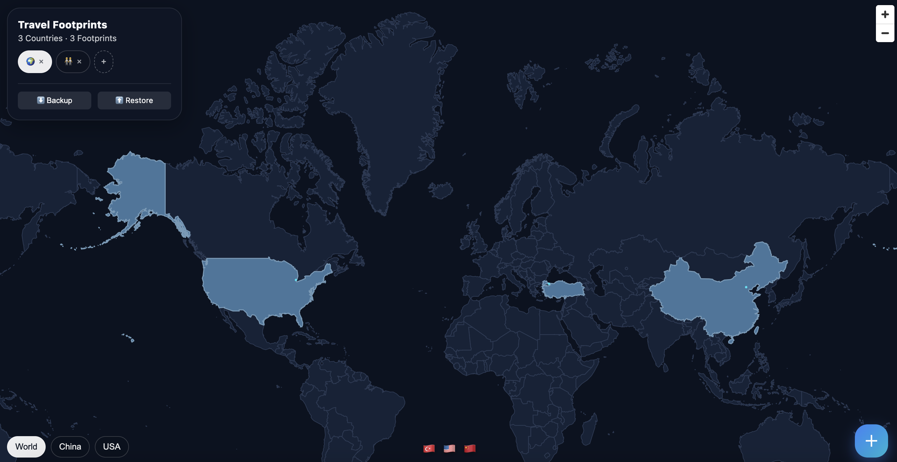
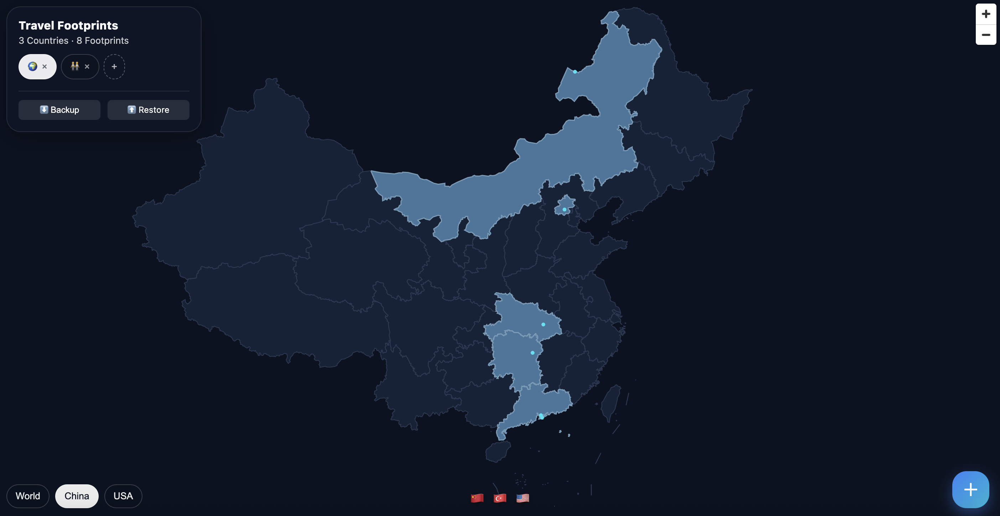

# 🌍 Via: Travel Footprints

> A privacy-first, interactive travel tracker. No backend, no database—your data stays in your browser.


---

## ✨ Key Features

* **🔒 Privacy First**: All data is stored locally in your browser (`localStorage`). No data is ever sent to a server. Your memories belong to you.
* **🌏 Smart Views**: Automatically switches between **World**, **China**, and **USA** views. 
* **🏷️ Multi-Tag System**: Create and manage multiple tags (e.g., "Me", "Couple", "Family"). Toggle between them to see different sets of footprints.
* **💾 Backup & Restore**: Export your data as a JSON file. Share your footprints with friends or sync between devices by simply uploading the backup file.
* **⚡️ Instant Search**: Integrated global geocoding allows you to search for any city and fly there instantly.

---

## 📸 Screenshots

### 1. World View


### 2. Focused View (e.g., China/USA)


---

## 🚀 Getting Started

### Option 1: Use Online (Recommended for Users)

If you just want to use the tool without coding:

👉 **[Click here to visit Travel Footprints](https://via-kappa-two.vercel.app/)**

1.  Open the link.
2.  Click the **+** button at the bottom right.
3.  Search for a city and click **Add**.
4.  **Backup**: Click the **Backup** button (top-left) to download your data.
5.  **Share**: Send the link and the JSON file to your friends. They can view your footprints by clicking **Restore**.

### Option 2: Self-Hosted (Deploy Your Own)

If you want your own personal link or wish to modify the code, you can deploy it to Vercel for free in one click.

#### 1. Fork this Repository
Click the **Fork** button at the top right of this page to copy the code to your GitHub account.

#### 2. Deploy to Vercel
Click the button below to deploy your forked repository. No server configuration required.

[](https://vercel.com/)

#### 3. Updates
Whenever you push changes to your GitHub repository, Vercel will automatically redeploy your site.

### Option 3: Local Development

For developers who want to contribute or modify features:

```bash
# 1. Clone the repository
git clone [git@github.com:hwyii/Via.git](git@github.com:hwyii/Via.git)

# 2. Install dependencies
npm install

# 3. Start the development server
npm run dev