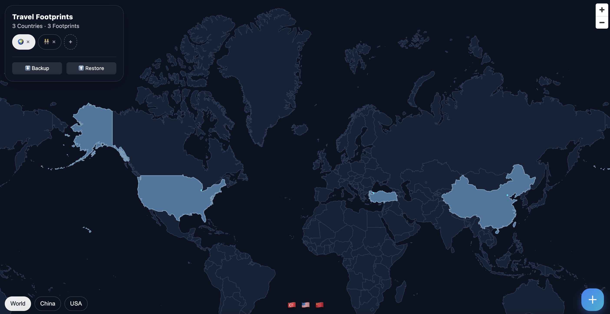
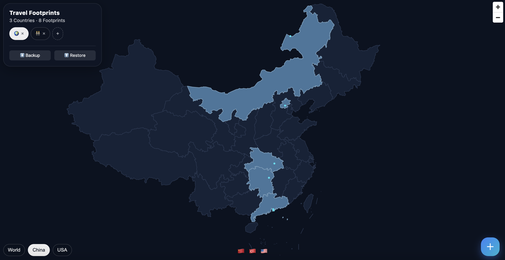
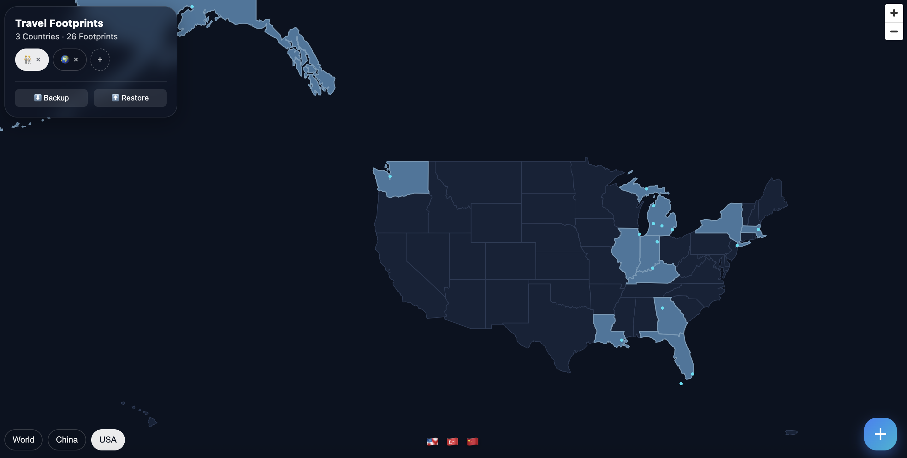

# 🌍 Via: Travel Footprints

> A privacy-first, interactive travel tracker. Your working data stays in your browser unless you explicitly publish it.


---

## 🆕 What's New

* **Transit Mode**: Mark places you have passed through separately from places you have truly visited.
* **Year & Country Stats**: Track travel years and see your visited country count at a glance.
* **U.S. National Parks**: Record and visualize your U.S. national park footprints.

---

## ✨ Key Features

* **🔒 Privacy First**: Working data is stored locally in your browser (`localStorage`). Data is only sent when you explicitly use the optional publishing feature.
* **🌏 Smart Views**: Automatically switches between **World**, **China**, **USA**, and **U.S. National Parks** views.
* **🚆 Transit Tracking**: Distinguish between places you visited and places you only passed through.
* **📊 Travel Stats**: See your visited country count and year-based travel summary.
* **🏷️ Multi-Tag System**: Create and manage multiple tags (e.g., "Me", "Couple", "Family"). Toggle between them to see different sets of footprints.
* **💾 Backup & Restore**: Export your data as a JSON file. Share your footprints with friends or sync between devices by simply uploading the backup file.
* **⚡️ Instant Search**: Integrated global geocoding allows you to search for any city and fly there instantly.

---

## 📸 Screenshots

### 1. World View


### 2. Focused View (e.g., China/USA)



---

## 🚀 Getting Started

### Option 1: Use Online (Recommended for Users)

If you just want to use the tool without coding:

Choose the link that works best for your location:

* Global / outside mainland China: **[Travel Footprints on Vercel](https://via-kappa-two.vercel.app/)**
* Mainland China: **[Travel Footprints on EdgeOne Pages](https://viatravel.edgeone.cool/?eo_token=7ebce4e03eea93d3d2c3e96551538a2f&eo_time=1779335384)**

1.  Open the link.
2.  Click the **+** button at the bottom right.
3.  Search for a city and click **Add**.
4.  **Backup**: Click the **Backup** button (top-left) to download your data.
5.  **Share**: Send the link and the JSON file to your friends. They can view your footprints by clicking **Restore**.

### Option 2: Self-Hosted (Deploy Your Own)

If you want your own personal link or wish to modify the code, you can deploy the app to Vercel, EdgeOne Pages, or any static hosting platform that supports Vite builds.

#### 1. Fork this Repository
Click the **Fork** button at the top right of this page to copy the code to your GitHub account.

#### 2. Deploy to Vercel
Click the button below to deploy your forked repository. No server configuration required.

[](https://vercel.com/)

#### 3. Deploy to EdgeOne Pages
EdgeOne Pages is a good option for users in mainland China. Import your GitHub repository in the EdgeOne Pages console and use the following build settings:

```txt
Framework: Vite / React
Install Command: npm install
Build Command: npm run build
Output Directory: dist
Root Directory: /
```

#### 4. Updates
Whenever you push changes to your GitHub repository, Vercel or EdgeOne Pages can automatically redeploy your site.

#### 5. Optional homepage publishing

The Vercel deployment can publish the current browser data to `public/footprints.json`, which is what the public/embed view loads. Add these environment variables in the Vercel project settings:

```txt
VIA_GITHUB_TOKEN=<fine-grained GitHub token with Contents: Read and write for this repository>
VIA_PUBLISH_SECRET=<a strong password used by the Publish to Homepage button>
```

Redeploy after adding the variables. The GitHub token is only read by the server-side Vercel Function and is never sent to the browser. Static-only hosts such as EdgeOne Pages do not provide this publishing endpoint.

### Option 3: Local Development

For developers who want to contribute or modify features:

```bash
# 1. Clone the repository
git clone git@github.com:hwyii/Via.git

# 2. Install dependencies
npm install

# 3. Start the development server
npm run dev

## Academic homepage embed

Run `npm run build:website` to rebuild the static map in the sibling
`hwyii.github.io/assets/travel-map` directory. The homepage loads this bundle
with `?embed=1` and sends `{ type: "via-theme", theme: "dark", palette: "espresso" }`
to apply the warm Espresso colors. Send `theme: "light"` to restore the light map.
Published travel data still loads from the Via repository, with a bundled fallback.
